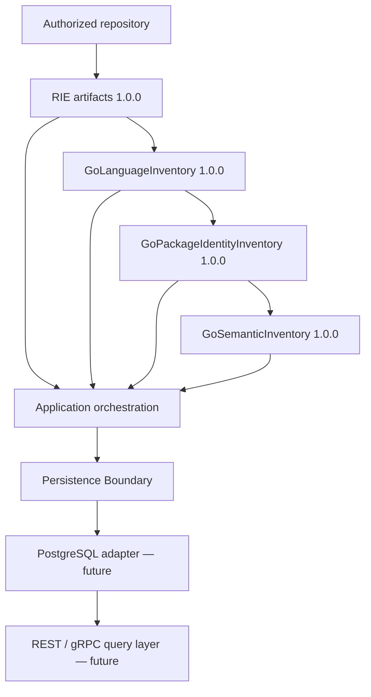

# Persistence Boundary

## Status

- Phase: 3.1 — Persistence Architecture
- Status: Accepted by engineering review
- Date: 2026-07-23
- Acceptance date: 2026-07-23
- Implementation authorization: Phase 3.2 schema specification documents only
- Database connections, credentials, executable SQL, migrations, and storage code remain unauthorized

## Purpose

The Persistence Boundary durably stores and retrieves immutable, versioned
platform artifact envelopes and exact payload bytes without changing engine
behavior or interpreting artifact semantics.

## Responsibilities

- Assign durable repository and scan identities.
- Accept completed immutable artifacts from an application orchestration layer.
- Preserve exact serialized payload bytes, artifact identity, provenance,
  content digest, and dependency edges.
- Publish a completed scan atomically so consumers never observe a partial
  artifact set.
- Expose storage-neutral application operations for later PostgreSQL adapters.
- Maintain rebuildable metadata, diagnostic, statistics, and query projections.
- Enforce supported artifact versions, payload limits, idempotency, and
  repository/tenant authorization.
- Record storage lifecycle and administrative actions in an audit trail.

## Non-Responsibilities

- Run RIE, LIE, semantic analysis, repository commands, tests, or builds.
- Change, enrich, normalize, repair, or infer artifact facts.
- Re-parse source or reconstruct missing engine output.
- Make PostgreSQL an input or dependency of any intelligence engine.
- Define REST, gRPC, React, AI, reasoning, or patch behavior.
- Store source files, ASTs, tokens, `go/types` objects, credentials, or secrets.
- Add a vector database, embeddings, event bus, cache, or object store.
- Implement SQL, migrations, database drivers, or connection configuration in
  Phase 3.1.

## Boundary and Dependency Direction



Allowed dependency direction:

```text
engines -> immutable artifacts -> application orchestration
                                -> persistence port
                                -> PostgreSQL adapter
```

Forbidden dependency direction:

```text
semantic engine -> PostgreSQL
artifact model  -> database row model
storage adapter -> engine internals
```

The persistence boundary is a downstream consumer. Removing it must not change
analysis results, artifact IDs, ordering, diagnostics, or performance.

## Artifact Ownership

| Concern | Owner |
|---|---|
| Artifact schema, facts, ordering, and stable IDs | Producing engine package |
| Artifact serialization contract | Producing artifact public API |
| Repository and scan lifecycle | Application/persistence boundary |
| Durable envelope and exact payload bytes | Persistence boundary |
| PostgreSQL tables, constraints, and migrations | PostgreSQL adapter |
| Query projections and indexes | Persistence adapter; rebuildable |
| REST/gRPC response models | Future API layer |

Persistence never writes fields into an artifact. An artifact is serialized
once, hashed, and submitted as an immutable value. A read returns the stored
envelope and exact bytes; decoding uses the registered codec for that artifact
name and version outside the engine.

## Inputs

### Repository Registration

- caller-generated idempotency key;
- stable repository identifier when already known;
- repository display name;
- optional source-system identity and repository-relative metadata;
- authorization/tenant context supplied by the application layer.

Absolute local paths are operational inputs, not repository identity. They are
not stored by default because paths reveal usernames and workstation layout.

### Scan Lifecycle

- repository ID;
- scan request ID/idempotency key;
- requested artifact set and engine versions;
- configuration digest, not secret-bearing configuration values;
- optional exact Git revision when locally proven;
- lifecycle timestamps and terminal status.

### Artifact Publication

- scan ID;
- artifact name and semantic version;
- codec media type and codec version;
- exact serialized payload bytes;
- SHA-256 digest of those exact bytes;
- payload size;
- ordered source-artifact/dependency references;
- bounded summary metadata needed to validate publication.

The boundary recalculates the digest before acceptance. It never accepts an
artifact name/version inferred from a table name or caller convention.

## Outputs

- immutable repository record;
- immutable completed scan record plus explicit lifecycle status;
- artifact envelope and exact stored bytes;
- ordered artifact dependency graph for one scan;
- rebuildable query projections;
- explicit storage diagnostics and audited lifecycle events.

Storage errors do not become engine diagnostics and never mutate an already
produced artifact.

## Conceptual Data Model

Phase 3.1 defines concepts, not SQL tables or column types.

### Repository

A durable logical software repository identity independent of a workstation
path. A repository may have many scans. Repository deletion and access state
belong here; analysis facts do not.

### Repository Scan

One immutable analysis attempt associated with a repository. Lifecycle states:

```text
requested -> running -> succeeded
                     -> failed
                     -> cancelled
```

Terminal states never transition back to running. A rescan creates a new scan.

### Artifact Envelope

Identifies one artifact within one scan:

- durable artifact ID;
- scan ID;
- artifact name and version;
- payload digest, size, media type, and codec version;
- creation timestamp;
- publication state;
- producer engine name/version when present in artifact metadata.

The uniqueness contract is `(scan ID, artifact name)`. Publishing two values
under the same name is an explicit conflict even if their bytes match.

### Artifact Payload

The exact serialized bytes are the source of truth. They are content-addressed
by SHA-256 and immutable after insertion. PostgreSQL `JSONB` normalization must
not replace or alter those authoritative bytes.

Phase 3.2 must choose and benchmark a bounded PostgreSQL representation for
the bytes. Large-artifact limits must be measured against the released
Kubernetes semantic fixture before schema approval. Exceeding the approved
limit fails explicitly; the system never truncates or silently splits an
artifact.

### Artifact Dependency

A directed edge from one scan artifact to the exact source artifact envelope
it declares. Publication validates that required names and versions exist in
the same completed set. Dependency rows preserve declared order where order is
part of the artifact contract.

### Query Projection

Metadata, `JSONB` documents, diagnostic indexes, statistics indexes, and future
search indexes are projections. They may be rebuilt from authoritative payload
bytes and never override them. A projection records its projector version and
source payload digest.

### Audit Event

Append-only record of repository registration, scan state changes, artifact
publication, retention/deletion, migration, restore verification, and
privileged access. Audit events contain identifiers and outcomes, not artifact
payloads or credentials.

## Why There Are No Go-Syntax Tables

Tables such as `go_functions`, `go_methods`, and `go_variables` would couple
storage to one language and duplicate the frozen artifacts. Phase 3 therefore
persists generic artifact envelopes and payloads. Language-specific query
projections may be proposed later only for measured API queries and must remain
rebuildable.

## Versioning Strategy

Four versions are independent:

1. **Artifact version** — owned by the engine, for example
   `go-semantic-inventory@1.0.0`.
2. **Stable-ID scheme** — owned by the artifact, for example
   `go-semantic-id/v1`.
3. **Payload codec version** — owned by persistence serialization and used to
   reproduce/verify stored bytes.
4. **Database schema version** — owned by the migration framework.

Rules:

- Every envelope stores all applicable versions explicitly.
- Unsupported artifact major versions are rejected, never coerced.
- A database migration never rewrites authoritative artifact payloads in place.
- Projection changes create a new projector version and rebuild.
- Artifact upgrades create a new scan/artifact; they do not mutate history.
- Reads must surface the stored artifact version to consumers.
- Migration rollback policy is defined per migration; destructive rollback is
  never assumed.

## Transaction and Publication Boundaries

Artifact payload staging and scan publication are separate concerns:

1. Create the scan and move it to `running` in a short transaction.
2. Validate and stage immutable payloads idempotently by content digest.
3. In one final publication transaction:
   - verify the scan is still running;
   - verify the required artifact set and exact dependency versions;
   - attach artifact envelopes to the scan;
   - create dependency edges and bounded projections;
   - transition the scan to `succeeded`;
   - append the publication audit event.
4. Consumers query only succeeded scans and published envelopes.

A failure before step 3 leaves no visible partial scan. Staged unreferenced
payloads are eligible for bounded garbage collection after a safety interval.
Failed/cancelled scans retain lifecycle metadata and bounded storage errors,
but not a falsely complete artifact set.

## Idempotency and Concurrency

- Repository registration and scan creation require caller idempotency keys.
- Retrying the same operation returns the original durable identity when the
  request digest matches.
- Reusing a key with different input fails explicitly.
- Only one terminal transition wins; concurrent finalization is serialized by
  the scan record.
- Payload insertion by digest is idempotent.
- Artifact-name uniqueness prevents double publication.
- Persistence does not globally prevent concurrent scans of one repository;
  such scheduling policy belongs to application orchestration.

## Repository Lifecycle

- Registration creates a logical repository record.
- Each analysis attempt creates a new scan; prior successful scans remain
  immutable.
- A repository may designate one successful scan as current through a mutable
  pointer owned by the repository record, never by the artifact.
- Failed and cancelled scans never replace the current successful scan.
- Repository archival hides it from normal queries without deleting evidence.
- Deletion is an explicit authorized workflow with an audit record and a
  defined purge state; it is never an accidental cascade from a scan update.

## Retention Policy

Phase 3.2 must turn retention into explicit configuration and constraints. The
policy must distinguish:

- successful scan history;
- failed/cancelled scan metadata;
- staged unreferenced payloads;
- audit events;
- backups and restore points;
- legal/tenant deletion requirements.

No default hard-delete duration is approved in Phase 3.1. Content-addressed
payload deletion requires proof that no retained artifact envelope references
the payload. Retention actions are bounded, retryable, and audited.

## Indexing Policy

Initial indexes must serve lifecycle and exact lookup only:

- repository identity and authorization scope;
- scan by repository, status, and creation order;
- unique scan/artifact name;
- artifact name/version and payload digest;
- artifact dependency endpoints;
- diagnostic severity/code projection when that query is approved.

Broad `JSONB` GIN indexes, language-specific indexes, full-text search, and
vector indexes require measured query evidence. Indexes are not added merely
because a field exists.

## Public Persistence Port

Phase 3.1 defines behavior, not final Go spelling. The Phase 3.4 port must be
storage-neutral and limited to operations equivalent to:

- register/get/archive repository;
- begin/fail/cancel scan;
- stage immutable artifact payload;
- atomically publish completed scan;
- get/list scans;
- get artifact envelope and exact bytes;
- verify payload digest;
- apply authorized retention operations.

The port uses domain values, not PostgreSQL row structs, SQL types, or driver
errors. Streaming readers/writers are preferred for bounded memory.

## Error Handling

Expected typed categories:

- invalid repository/scan identity;
- unsupported artifact or codec version;
- digest or size mismatch;
- duplicate artifact publication;
- missing/incompatible dependency;
- invalid lifecycle transition;
- idempotency conflict;
- authorization denied;
- payload too large;
- unavailable storage;
- serialization, transaction, migration, or integrity failure.

Errors include durable identifiers and safe codes. They never include payload
bytes, database credentials, connection strings, or secret-bearing SQL values.

## Logging and Audit

Logs may contain repository ID, scan ID, artifact name/version, digest prefix,
payload size, duration, row counts, migration version, and error code. Logs
must not contain source content, complete artifact payloads, access tokens,
passwords, connection strings, or absolute local paths.

Audit events are append-only application facts. Database server logs are not a
substitute for the application audit trail.

## Security and Privacy

- Credentials come from environment/secret injection only after Phase 3.5 and
  are excluded from Git and documentation.
- Separate database roles are required for migration ownership, application
  writes, API reads, and backup/restore operations.
- Application roles do not own schemas and cannot disable constraints.
- TLS is required outside an explicitly local development environment.
- Parameterized operations are mandatory; callers never concatenate SQL.
- Artifact payloads, relative paths, identifiers, diagnostics, and evidence are
  treated as sensitive repository metadata even though source text is absent.
- Authorization is checked before repository, scan, artifact, projection, or
  audit access.
- Multi-tenant row-level security is a future decision, not assumed security.
- Encryption-at-rest and key ownership follow the deployment environment and
  must be documented before production.

## Backup and Recovery

Development may use logical backups. Production approval requires:

- automated backups plus point-in-time recovery capability;
- encrypted backup storage and restricted restore credentials;
- documented RPO/RTO approved for the deployment;
- migration-version-aware restore procedure;
- periodic restore drills into an isolated environment;
- artifact digest verification after restore;
- an audit record for backup and restore operations.

A backup is not considered valid until restoration and digest verification have
been demonstrated.

## Configuration

Phase 3.1 defines configuration categories only:

- connection endpoint and database identity;
- credential source;
- TLS mode and trust roots;
- connection pool bounds and timeouts;
- transaction timeout;
- maximum artifact payload size;
- staging expiry and retention policy;
- migration mode;
- integrity-verification sampling/full-check mode.

Defaults and environment variable names are not frozen until Phase 3.5. No
credential value belongs in Git.

## Testing Strategy

### Contract Tests

- storage-neutral port behavior against an in-memory conformance harness;
- lifecycle transition matrix;
- idempotency and duplicate publication;
- exact payload-byte and digest round trips;
- artifact dependency/version validation;
- immutable read behavior and explicit errors.

### PostgreSQL Integration Tests — Future

- migrations from an empty database and every supported prior schema;
- transaction rollback and concurrent finalization;
- process/database interruption during staging and publication;
- retention safety with shared payloads;
- least-privilege role tests;
- backup/restore plus digest verification;
- real released artifact fixtures, including Kubernetes-scale semantic output.

Tests use disposable local credentials supplied outside Git. Production
credentials and data are forbidden in test environments.

## Performance and Scale Gates

Phase 3.2 must measure and approve numeric targets before implementation. The
gate must include:

- small RIE-only scan;
- ordinary Go scan containing all released artifacts;
- pinned OpenTelemetry scan;
- pinned Kubernetes semantic scan at the one-million relationship limit;
- payload write, atomic publication, exact read, projection rebuild, retention,
  backup, and restore;
- latency, throughput, database size, WAL volume, peak application memory, and
  concurrent-reader behavior.

The adapter must stream large payloads where practical and must not require a
second complete in-memory copy merely to persist them. Cold filesystem,
serialization, network, and database times are recorded separately.

## Migration Principles

- Migrations are ordered, immutable after release, checksum-verified, and
  executed exactly once.
- The application refuses a database schema newer than it supports.
- Startup does not silently apply production migrations unless explicitly
  configured and authorized.
- DDL and backfill steps are separated when lock duration or data volume makes
  one transaction unsafe.
- Every destructive migration requires backup/restore evidence and an approved
  rollback or forward-repair plan.
- Artifact payload bytes are never rewritten as a side effect of schema
  migration.

## Future Extensions

- content-addressed external object storage after PostgreSQL payload limits are
  measured;
- read replicas and partitioning after measured scale;
- language-specific or graph projections after approved query requirements;
- event publication through an outbox after an actual integration consumer;
- multi-tenant row-level security after tenancy is designed;
- Qdrant as a rebuildable retrieval index, never a source of truth.

## Phase 3.1 Exit Gate

Engineering review must explicitly approve:

1. persistence as a downstream artifact consumer;
2. exact payload bytes as source of truth and projections as rebuildable;
3. conceptual repository/scan/artifact/dependency/audit model;
4. atomic scan publication and idempotency rules;
5. independent artifact, codec, projector, and database versions;
6. lifecycle, retention, security, backup, and recovery boundaries;
7. the staged Phase 3 roadmap and its implementation gates;
8. PostgreSQL as the first adapter without coupling engines to it.

Engineering accepted this boundary on 2026-07-23. The acceptance authorizes
Phase 3.2 schema specification only. It does not authorize executable SQL,
migrations, database connections, credentials, or Go persistence code.
